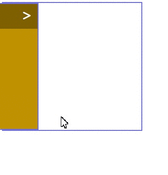

## (MOVABLE MENU)
👨‍💻 The main aim of this project is to improve my <b>HTML/CSS skills and ©️cloning abilities</b>.

🎯 Challenge is to build out this landing page and get it looking as close to the professional design as possible..

🔗 To see live version 🎯https://tal58.github.io/HTML_CSS_WORKSHOP/Movable_Menu/
 

 ⌛ Happy Coding  ✍ 

  
🌐 The desktop and mobile versions of the web page are as follows;🧭
  

## 🖥️Desktop version
 

 
 
 
 
 
 
 
 
 
         
